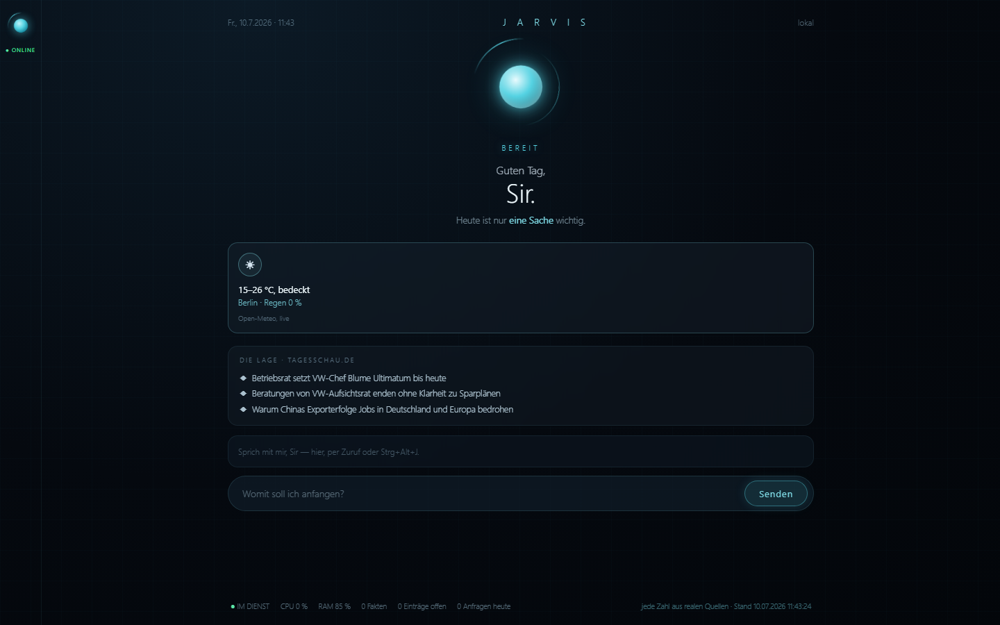

# J.A.R.V.I.S. — ein persönlicher Assistent, der wirklich bei dir wohnt

Sag **„Hey Jarvis"** quer durchs Zimmer. Drück einen Hotkey. Schreib ihm per
Telegram von unterwegs. Oder tipp in sein Fenster mit dem atmenden Orb.
Dahinter arbeitet **eine** Pipeline — mit Gedächtnis, Sicherheitsstufen und
einem Dashboard, in dem **jede Zahl echt ist**. Komplett lokal gehostet,
Cloud nur dort, wo sie gebraucht wird (LLM, Transkription).



**Das Problem:** Assistenten, die beeindruckend aussehen, sind meist Kulisse —
und die echten wohnen in fremden Clouds.
**Die Lösung:** ein Assistent auf dem eigenen Rechner, dessen Fähigkeiten
einzeln, testgetrieben und dokumentiert gewachsen sind.
**Der Nutzen:** Erinnerungen, die sich von selbst melden; Briefings aus echten
Quellen; kritische Aktionen nur mit Bestätigung — und ein Gesicht, das zeigt,
was gerade wirklich passiert.

## Was Jarvis kann

- **Vier Zugänge, eine Pipeline:** Wake-Word („Hey Jarvis", 100 % lokal
  bewertet), Push-to-talk, Telegram (Text + Sprachnachrichten), Browser-UI —
  alle laufen durch denselben Planner, dieselben Befehle, dieselben
  Sicherheitsstufen.
- **Ein Gesicht, das nicht lügt:** Der Orb atmet die echten Zustände der
  Sprachpipeline (hört zu / arbeitet / spricht), die Tages-Karten („Heute sind
  nur drei Dinge wichtig") kommen aus echten Quellen — Erinnerungen, Wetter,
  Mail. Nichts ist inszeniert.
- **Erinnerungen end-to-end:** „Erinnere mich morgen um 9 an den Zahnarzt" —
  gesprochen, verstanden, gespeichert, und morgen um 9 meldet er sich von
  selbst per Push.
- **Briefings statt Halluzinationen:** Nachrichten aus RSS (mit Quelle),
  Wetter von Open-Meteo, Mail-Überblick aus IMAP-Kopfzeilen (kein Inhalt
  verlässt den Rechner). Der Chat darf per Prompt-Regel **keine** aktuellen
  Fakten erfinden.
- **Sicherheit als Architektur:** Sicherheitsstufen mit Bestätigungsdialog
  (Stufe 3 verlangt eine exakte Phrase — auch remote), fail-closed als
  Grundhaltung, Auto-Schwärzung von Secrets vor jeder Persistenz, lokale APIs
  nur auf 127.0.0.1 mit Origin-Prüfung, Release-Hygiene-Scanner vor jeder
  Veröffentlichung.
- **Delegation:** Jarvis reicht Repo-Analysen an einen Coding-Agenten weiter —
  strikt read-only, mit Kill-Switch und Kosten-Logging.
- **Dokumentationsgetrieben gebaut:** jede Architektur-Entscheidung als ADR,
  Konsistenz-Gate und komplette Testsuite im Pre-Commit, ehrliches Logbook
  inklusive der Fehlschläge.

## Schnellstart (Windows)

```powershell
git clone <repo-url> jarvis && cd jarvis
powershell -ExecutionPolicy Bypass -File setup.ps1   # venv + Pakete + config
setx OPENAI_API_KEY "sk-..."                         # Key NUR als Env-Variable
.venv\Scripts\pythonw.exe jarvis_ui.pyw              # Runtime + UI-Fenster
```

Ohne Key startet alles außer LLM/Transkription; Telegram, Sprachausgabe und
Wake-Word sind optionale Zusatzschritte (siehe unten).

## Ehrliche Grenzen

- **Windows-first:** Sprachausgabe, Single-Instance-Lock und Starter nutzen
  Windows-Bordmittel; andere Plattformen sind ungetestet.
- **Braucht einen OpenAI-Key** (Planner/Chat/Whisper) — variable Kosten im
  Cent-Bereich pro Tag; TTS offline per Piper möglich.
- **Deutsch zuerst:** Persona, Befehle und Beispiele sind auf Deutsch gebaut.
- **Ein-Personen-System by design:** genau ein Nutzer, genau ein autorisierter
  Telegram-Chat — Mehrbenutzer ist ein Nicht-Ziel.

---

## Für Entwickler (Mensch oder KI)

**Verbindlicher Einstieg: zuerst `CONTRIBUTING.md` lesen** (Jarvis Developer Charter) — sie beschreibt den vollständigen Entwicklungsprozess.

- **Wofür / was** (Vision, DNA, Leitplanken, Architekturprinzipien) → Handbook / Projektverfassung (`docs/handbook/HANDBOOK.md`).
- **Wie entwickelt wird** (Prozess, Session-Runbook, Freigaberegeln) → **`CONTRIBUTING.md`**.
- **Aktueller Stand** → `docs/PROJECT_STATE.md`. **Historie** → `docs/CHANGELOG.md`. **Entscheidungen** → `docs/adr/`.

## Struktur

Der vollständige, **aktuelle** Verzeichnisbaum wird aus dem Repository generiert, statt von Hand gepflegt zu werden:

```bash
python scripts/gen_structure.py
```

*Warum keine statische Baumgrafik mehr:* Eine handgepflegte Struktur veraltet unweigerlich (sie hatte real fehlende Module) und musste doppelt gepflegt werden. Die generierte Ableitung ist immer aktuell und hat genau eine Quelle — den Code selbst.

Grober Überblick der Bereiche:

- **`core/`** — Kern: Config, Modelle, AI-Layer, Planner, Tool-Manager, Speech, Single-Instance, Provider/Mail-Reader/Web-Search.
- **`commands/`** — Command-Registry + Commands (System, Memory, Monitor, Installer, Excel, Reports, Mail, Web).
- **`executor/`** — führt Pläne aus (Bestätigung, ✓/✗/?-Report).
- **`memory/`** — Kurz-/Langzeitgedächtnis + Mail-Regeln.
- **`scripts/`** — Werkzeuge: Konsistenz-Gate, Struktur-Generator.
- **`tests/`** — pytest, alles gemockt.
- **`docs/`** — `PROJECT_STATE`, `CHANGELOG`, `logbook`, `handbook/HANDBOOK.md` (Verfassung), `adr/`.
- **Einstiegspunkte** — `main.py` (Konsole), `telegram_main.py`, `jarvis_runtime.py` (Runtime).
- **Governance** — `CONTRIBUTING.md` (Prozess), `docs/handbook/HANDBOOK.md` (Verfassung).

## Setup

```bash
pip install -r requirements.txt
cp config.example.json config.json
export OPENAI_API_KEY="sk-..."   # überschreibt config.json
python main.py
```

Für den **vollständigen Laufzeit-Betrieb** (Telegram-Runtime, Word-Export,
Claude-Provider, TTS) statt der Kern-Deps: `pip install -r requirements-runtime.txt`
— installiert die real genutzten, in `requirements.txt` optional gehaltenen Pakete
gleich mit (reproduzierbarer venv-Neuaufbau, ADR-037).

## KI-Provider wählen: OpenAI oder Claude (v0.8 Multi-KI, Phase 1, ADR-029)

Jarvis kann **explizit** zwischen zwei KI-Anbietern wählen. Gesteuert wird das
über ein einziges Config-Feld `ai_provider` in `config.json`:

- `"openai"` (Standard): nutzt `openai_api_key` (aus `OPENAI_API_KEY`) und
  `model` (Standard `gpt-4o-mini`) - unverändert wie bisher.
- `"claude"`: nutzt Anthropic mit `claude_model` (Standard `claude-sonnet-5`).

Für Claude sind zwei zusätzliche Schritte nötig:

```bash
pip install anthropic          # optional - nur für ai_provider="claude"
export ANTHROPIC_API_KEY="sk-ant-..."   # nur per Env, nie in config.json/Git
```

`config.json` setzt dann nur die Auswahl (kein Key im File):

```json
{ "ai_provider": "claude", "claude_model": "claude-sonnet-5" }
```

Reine OpenAI-Setups brauchen weder das Paket `anthropic` noch den Key - der
Import erfolgt lazy, nur wenn `ai_provider="claude"`. Fehlt bei
`ai_provider="claude"` das Paket oder `ANTHROPIC_API_KEY`, bricht Jarvis mit
einer klaren Fehlermeldung ab (kein stiller Fehlschlag). Es gibt **kein**
Auto-Routing und keine Laufzeit-Umschaltung - die Auswahl ist bewusst rein
konfigurativ (spätere v0.8-Phasen, ADR-029). Für den Autostart gilt wie bei
`OPENAI_API_KEY`: `ANTHROPIC_API_KEY` dauerhaft per `setx` setzen (siehe
Telegram-Abschnitt).

## Mail-Briefing „Was liegt an?" (Nutzwert-Phase, ADR-031)

Auf „Jarvis, was liegt an?" trägt Jarvis einen knappen Überblick über deine
neuen/ungelesenen privaten Mails vor – Werbung/Newsletter werden ausgeblendet
(aber gezählt, nie stumm verworfen), Wichtiges wird genannt. **Rein lesend**
(nichts wird gesendet, gelöscht oder als gelesen markiert), **rein lokal**:
es werden nur Kopfzeilen gelesen, **kein Mailinhalt geht an eine KI**.

Einrichtung (Beispiel Gmail):
1. In `config.json` unter `mail_accounts` das Postfach hinterlegen (nur
   nicht-geheime Felder – siehe `config.example.json`):
   ```json
   "mail_accounts": [
     { "label": "Gmail", "imap_host": "imap.gmail.com", "imap_port": 993,
       "username": "du@gmail.com", "password_env": "JARVIS_GMAIL_APP_PASSWORD" }
   ]
   ```
2. Bei Gmail ein **App-Passwort** erzeugen (setzt Zwei-Faktor-Anmeldung voraus)
   und **als Umgebungsvariable** setzen – niemals in `config.json`/Git (ADR-018).
   Für den Autostart dauerhaft per `setx` (siehe Telegram-Abschnitt):
   ```bash
   setx JARVIS_GMAIL_APP_PASSWORD "abcd efgh ijkl mnop"
   ```
   Ist das Passwort nicht gesetzt, wird das Konto beim Start übersprungen – so
   kann man Gmail zuerst einrichten und weitere Konten später nachziehen.

**Hotmail/Outlook.com:** IMAP-Host `outlook.office365.com`. Microsoft baut
Basis-Auth/App-Passwörter zunehmend zugunsten von OAuth2 ab – ob ein
App-Passwort noch funktioniert, hängt von den Kontoeinstellungen ab. Deshalb
zuerst Gmail nutzen und Hotmail bei Bedarf verifizieren.

**Lernen (korrigierbare Regeln):** Sag „von Amazon will ich nichts mehr"
(künftig ausblenden) oder „das ist keine Werbung" bzw. „von X will ich immer
hören" (künftig immer zeigen). Die Regeln liegen menschenlesbar lokal
(`memory_data/mail_rules.json`) und schlagen immer die automatische Erkennung.
„zeig mir die Werbung" blendet die ausgeblendeten Mails einmalig ein.

## Web v1 - read-only Websuche (Nutzwert-Phase, ADR-032)

Jarvis kann auf ausdrueckliche Web-/Internet-/Recherche-Anfragen eine kleine,
aktuelle Websuche ausfuehren und einen knappen Ueberblick mit Quellen liefern.
Der Scope bleibt bewusst eng: **kein Browser**, **kein Oeffnen von Treffern**,
**keine Aktionen**, **keine ganze Seitenextraktion**.

Verfuegbar ist Web v1 lokal ueber `main.py`, ueber den separaten Telegram-Bot
`telegram_main.py` und ueber den Runtime-Telegram-Kanal in `jarvis_runtime.py`.

Beispiele:

```text
Du: Suche im Web nach aktuellen KI-Nachrichten
Jarvis: <kurzer Ueberblick>

Quellen:
1. ...
2. ...
```

```text
Du: Was kostet die PS5?
Jarvis: <knapper Preis-Ueberblick mit Quellen>
```

Technisch holt Jarvis nur die obersten Treffer (Titel, Snippet, URL) aus der
DuckDuckGo-Lite-Suche und laesst daraus eine kurze Zusammenfassung formulieren.
Die Quellen werden immer sichtbar mit ausgegeben, damit du wichtige Punkte
selbst oeffnen und pruefen kannst. Offensichtliche DuckDuckGo-Werbe-/Hilfstreffer
werden dabei ausgefiltert.

**Bewusst nicht Teil von Web v1:** Treffer oeffnen, Browser steuern, ganze
Artikel lesen, Login-geschuetzte Seiten, News-Speziallogik, generische
Connector-Plattform.

## Repo-Analyse delegieren (Agenten-Arm, Scheibe 1, ADR-033/034)

Jarvis kann eine **read-only** Analyse eines lokalen Code-Repositorys an einen
Agenten delegieren. Erstes Backend ist die Claude Code CLI, die als Subprozess
im Print-Modus laeuft (`claude -p --allowedTools Read Grep Glob`). Die Analyse
laeuft **lokal & synchron**; das vollstaendige Ergebnis wird als Markdown-
Artefakt unter `memory_data/delegations/<zeitstempel>.md` abgelegt, im Kanal
erscheint eine Kurz-Zusammenfassung.

**Sicherheit (Sicherheitsstufe 0):** read-only erzwungen (nur Read/Grep/Glob -
kein Schreiben/Ausfuehren, **keine git-Operation**), Repo-Allowlist fail-closed,
harter Timeout (Kill-Switch), vollstaendiges Logging (Repo · Frage · Backend ·
Dauer · Status · Kosten). Das Ergebnis ist rein informativ und loest nie selbst
eine Aktion aus (Trust Boundary).

**Voraussetzung:** Claude Code muss installiert und angemeldet sein (der
Subprozess erbt den Account-Login). In `config.json` ein oder mehrere Repos
freigeben:

```json
"agent_repos": [
  { "alias": "jarvis", "path": "C:\\KI\\jarvis" }
],
"agent_timeout": 300.0
```

Nur ausdruecklich gelistete, real existierende Pfade sind analysierbar - alles
andere wird abgelehnt (fail-closed).

Beispiel (lokal, Konsole - synchron):

```text
Du: analysiere jarvis: wie funktioniert der Executor?
Jarvis: Analyse von 'jarvis' fertig:
<kurzer Anriss>
Vollstaendig abgelegt unter: .../memory_data/delegations/20260706-….md
```

### Asynchron über Telegram (Scheibe 2, ADR-035)

Über den **Runtime-Telegram-Kanal** (`jarvis_runtime.py`) läuft die Analyse
asynchron, damit du unterwegs nicht auf die Antwort warten musst:

```text
Du:     analysiere jarvis: wie funktioniert der Executor?
Jarvis: Verstanden - ich analysiere 'jarvis' und melde mich, sobald das Ergebnis da ist.
        (… Minuten später, als Push …)
Jarvis: ✓ Analyse von 'jarvis' fertig: <kurzer Anriss>  (+ Artefakt-Verweis)
```

- Der serielle Nachrichten-Worker bleibt frei - normale Nachrichten werden
  währenddessen sofort beantwortet.
- **Genau eine** Analyse gleichzeitig: eine zweite Anfrage wird höflich
  abgelehnt, bis die erste fertig ist.
- Telegram ist dabei nur **Transportkanal**; die Hintergrund-Orchestrierung
  (Thread, Quittung/Push, Kill-Switch beim Herunterfahren) liegt vollständig in
  der Runtime.

**Bewusst nicht:** Über den älteren **Standalone-Bot** (`telegram_main.py`)
bleibt `delegate_analysis` abgelehnt - er hat keinen Hintergrund-Worker und
würde bei einer Minuten-Analyse blockieren. Ebenfalls weiter tabu: mehrere
Agenten parallel.

### Schreibende Delegation im Käfig (ADR-050)

Auf „**erledige in jkc: …**" delegiert Jarvis Umsetzungsarbeit an den Agenten -
in einem **eigens freigegebenen** Projekt-Repo (`agent_write_repos`, bewusst
getrennt von `agent_repos`: lesen heißt nie schreiben). Der Agent darf **nur
unterhalb dieses Repos schreiben** (kein Bash, kein git, nichts ausführen -
physisch unmöglich, nicht nur verboten), Vorbedingung ist ein sauberer
Arbeitsbaum, und **nichts wird committet**: Ergebnis sind Änderungen im
Arbeitsbaum plus ein Diff-Artefakt unter `memory_data/delegations/` zur
Sichtung. Sicherheitsstufe 2 - Bestätigung erforderlich.

### „Mach weiter an <projekt>" (project_continue)

Die Kurzform des Scheiben-Zyklus: Auf „**mach weiter an jkc**" liest Jarvis
den Projektstand des Zielprojekts (PROJECT_STATE + logbook, read-only),
formuliert daraus **selbst** den nächsten Arbeitsauftrag und zeigt die
Kurzfassung direkt in der Bestätigungsfrage:

```text
Du:     mach weiter an jkc
Jarvis: Ich würde jetzt ausführen: project_continue (jkc).
        Nächster Schritt in 'jkc': AP2 CLI Erfassen/Lesen: … Bestätigen?
Du:     ja
Jarvis: Verstanden - ich arbeite in 'jkc' und melde mich. (… Push mit Diff-Artefakt …)
```

Nach dem Ja läuft exakt die Schreib-Delegation von oben (Käfig, sauberer
Baum, Diff-Artefakt, nichts committet). Ehrlich und fail-closed: nur für
Schreib-freigegebene Projekte, und findet sich im Projektstand **kein**
dokumentiertes nächstes Arbeitspaket, empfiehlt die Rückfrage das Nein -
es wird nie ein Auftrag erfunden.

## Nächsten Schritt planen (erste Orchestrierungs-Kette, ADR-036)

Auf „**plane den nächsten Schritt**" / „**bereite die nächste Scheibe vor**" liest
Jarvis **read-only** den eigenen Projektstand (PROJECT_STATE, Handbook, jüngste
ADRs, CHANGELOG, logbook, offene TODOs), lässt einen Spezialisten **einen**
konkreten, klein geschnittenen nächsten Schritt ableiten und legt einen Entwurf
in fester Struktur unter `memory_data/proposals/` ab:

```text
Du:     plane den nächsten Schritt
Jarvis: Vorschlag für den nächsten Schritt:
        # <Titel>  ## Kurzfassung … ## Empfehlung …
        Entwurf abgelegt unter: .../memory_data/proposals/20260707-….md
```

- **Jarvis schlägt nur vor — keine Umsetzung** (Governance-Invariante, Handbook Teil 6). Der Entwurf ist ein Vorschlag zur Freigabe.
- **Ehrlich:** Findet sich kein klar begründbarer Schritt, sagt Jarvis das, statt einen zu erzwingen.
- **Sicher by design:** der Agent bleibt strikt read-only; den Entwurf schreibt Jarvis selbst **additiv** (neue Datei, kein Überschreiben, kein Code, kein Git).
- Async über den Telegram-Runtime-Kanal (Quittung → Push), lokal über die Konsole synchron.

## Jarvis beenden (Runtime herunterfahren)

Über den **Runtime-Telegram-Kanal** fährt Jarvis sich auf „**beende dich**" /
„**fahr dich runter**" / „**beende Jarvis**" selbst sauber herunter (`stop_runtime`)
— gemeint ist **Jarvis, nicht der Rechner** (das wäre `shutdown_pc`). Jarvis
schickt zuerst die Zusage („ich fahre herunter"), stellt sie sicher zu und
beendet dann die Runtime. Zum Wiederanlauf den Autostart bzw.
`pythonw jarvis_runtime.py` nutzen. (Die Konsole hat weiterhin ihr Exit-Wort.)

## Release-Hygiene-Scanner (Welle 4.1)

`python scripts/release_scan.py` prüft die **git-getrackten** Dateien vor
jeder Veröffentlichung: Secret-Muster (API-Keys, Bot-Tokens, private
Schlüssel, Passwort-Literale), verbotene getrackte Pfade (config.json,
memory_data/, logs/, voices/), E-Mail-Adressen (Hinweis) und persönliche
Begriffe aus einer **lokalen, selbst gitignorierten** Liste
(`release_scan_local_terms.txt` — die Begriffe stehen dadurch nie im Repo).
Funde werden maskiert ausgegeben; Ausnahmen sind explizit
(`# release-scan: ok (Begründung)` je Zeile, `release-scan: datei-ok` je
Datei). Exit 1 bei kritischen Funden = nicht veröffentlichen.

## Browser-Kanal / Runtime-API (ADR-047)

Mit `"ui_enabled": true` startet die Runtime eine **lokale API** für das
Jarvis-UI (Basis für das kommende „Gesicht"): `POST /message` reicht eine
Nachricht in die normale Pipeline (volle Intents; Stufe 2/3 über den
Bestätigungsdialog wie bei Telegram), `GET /events` streamt Antworten,
Rückfragen und Orb-Zustände (bereit/arbeitet/wartet) als Server-Sent
Events. Nur `127.0.0.1` (Port `ui_port`, Default 8766) plus
Origin-Prüfung — fremde Webseiten im selben Browser werden abgewiesen.
Standard: **aus**.

## Jarvis-UI / Command Center (ADR-046 + ADR-047)

`python dashboard.py` (oder die Desktop-Verknüpfung) startet **Jarvis'
Gesicht** auf `http://127.0.0.1:8765/`: Begrüßung mit Tages-Karten aus
ausschließlich **echten Quellen** (nächste Erinnerung, Wetter, offene
Merkposten), der **Orb** atmet den Live-Zustand (bereit/arbeitet/wartet/
außer Dienst — via SSE vom BrowserChannel), und die **Chat-Leiste** spricht
mit der normalen Pipeline inkl. Stufe-2/3-Bestätigungsdialog. Läuft die
Runtime nicht, degradiert die Seite würdevoll zur read-only-Anzeige.
Eigener lesender Prozess, nur localhost, stdlib-only, self-contained
(kein CDN — auch die Schriften Rajdhani/Inter liegen als OFL-Dateien im
Repo und werden lokal serviert). `owner_name`/`dashboard_port`/`ui_port`/
`ui_window` (Vollbild/maximiert) in `config.json`; ein ⛶ in der Kopfzeile
schaltet Vollbild jederzeit um.
Bequemster Start: `pythonw jarvis_ui.pyw` (bzw. die Desktop-Verknüpfung) —
startet den Server unsichtbar und öffnet Jarvis als eigenes Fenster im
Browser-App-Modus (ohne Tabs/Adressleiste).

Weitere Ansichten und Live-Elemente (alles echte Daten, nichts Kulisse):
**GEDÄCHTNIS-Ansicht** (Nav oben) zum Blättern durch Fakten, Einträge,
Listen und Verlauf — mit ✕ zum stillen Löschen einzelner Fakten/Einträge
über zwei hart begrenzte lokale Endpunkte; **Live-Zeile** unter der
Begrüßung („Ich arbeite gerade: …"), **AGENT-Kachel** (laufende
Delegationen mit Dauer), **Sprech-Leiste** mit Equalizer (läuft nur bei
echtem Hören/Sprechen), **Aktiv-Glow** an Panels, in denen gerade etwas
passiert, und Fußzeilen-Zahlen (Uptime, Ø-Sprach-Antwortzeit, KI-Verbrauch
heute). Nach einem Neustart lädt das Gespräch die letzten Zeilen des
geteilten Verlaufs („— VORHER —").

## Kritische Befehle per Telegram bestätigen (ADR-045)

Bestätigungspflichtige Befehle (Stufe 2 = Ja/Nein, Stufe 3 = exakte Phrase,
z. B. `shutdown_pc` → `HERUNTERFAHREN`) funktionieren jetzt auch über den
Runtime-Telegram-Kanal: Jarvis stellt die **Rückfrage im Chat**, die nächste
**Textnachricht** ist die Antwort (sie geht nie durch den Planner). Keine
Antwort in 120 s, „nein" oder eine falsche Phrase ⇒ Abbruch (fail-closed).
Sprachnachrichten zählen nicht als Bestätigung; PTT/Wake-Word/Konsole der
Runtime bleiben ohne Bestätigungsweg (dort weiterhin kein Stufe 2/3).

## Fernbedienung: Sperren, Lautstärke, Medien, Ruhezustand (ADR-058)

Jarvis steuert den PC wie eine Fernbedienung — per Sprachbefehl vom Sofa
oder per Telegram von unterwegs:

```
Du: Sperr den Bildschirm
Jarvis: Bildschirm gesperrt, Sir.

Du: Mach leiser            → Lautstärke −10 % (Medientasten, ±2 % je Druck)
Du: Ton aus                → Stumm-Umschalter
Du: Nächstes Lied          → Medientaste „Weiter" (wirkt auf Spotify, Browser, VLC …)
Du: Schick den PC schlafen → Rückfrage (Stufe 2, Ja/Nein), dann Ruhezustand
```

`lock_pc`, `set_volume` und `media_control` sind Sicherheitsstufe 1
(jederzeit umkehrbar, keine Bestätigung — Sperren aus der Ferne ist sogar
ein Sicherheitsgewinn). `sleep_pc` ist Stufe 2: einfache Ja/Nein-Bestätigung
(remote über das ConfirmationGate, ADR-045) — anders als `shutdown_pc`
(Stufe 3, exakte Phrase) ist der Rechner per Tastendruck wieder da. Ehrliche
Grenze: nach dem Ruhezustand ist auch Jarvis bis zum Wecken weg (kein
Wake-on-LAN). Alles Windows-Bordmittel (virtuelle Medientasten, `rundll32`),
keine neue Abhängigkeit; auf anderen Plattformen lehnt die
Lautstärke-/Mediensteuerung ehrlich ab.

## Jarvis neu starten (`restart_runtime`)

Auf „**starte dich neu**" / „**Neustart**" startet Jarvis sich selbst neu:
Er startet zuerst einen abgekoppelten Nachfolger-Prozess (gleicher
Interpreter, wartet per `JARVIS_WAIT_FOR_LOCK` bis zu 30 s auf die Freigabe
des Single-Instance-Locks — Staffelstab statt Doppelstart) und fährt sich
dann sauber herunter. Scheitert schon der Nachfolger-Start, bleibt Jarvis
im Dienst und sagt das ehrlich. Ein versehentlicher Doppelstart ohne das
Flag bricht unverändert sofort ab (ADR-026).

## Einträge: Erinnerungen, Aufgaben & wichtige Merkposten (A1)

Jarvis merkt sich Einmaliges — per Text oder Sprachnachricht:

```text
Du:     erinnere mich morgen um 9 an den Zahnarzt
Jarvis: Eintrag gespeichert: «Zahnarzt» — 10.07.2026 09:00
Du:     wichtiger Termin: am 12.07.25 war die Konferenz in Musterstadt
Jarvis: ⭐ Wichtiger Eintrag gespeichert: «Konferenz in Musterstadt» — 12.07.2025
Du:     was steht an?
Jarvis: Deine Einträge: …
Du:     lösch die Zahnarzt-Erinnerung
Jarvis: 🗑 Eintrag gelöscht: «Zahnarzt»
```

- Relative Zeiten („morgen", „nächsten Montag") rechnet der Planner um — das
  **Echo nennt die verstandene Zeit**, damit Verhörer sofort auffallen.
- Standard-Liste: offene/zukünftige Einträge **plus alle wichtigen** (auch
  vergangene ⭐-Merkposten zum Nachschlagen); Rest der Vergangenheit nur auf
  Nachfrage.
- Abgrenzung: dauerhafte Fakten über dich → „merk dir …" (`remember_fact`);
  Einmaliges/Terminiertes → Eintrag.
- **Wiederkehrend** (ADR-052): „erinnere mich **täglich** um 19:54 an …" /
  „**jeden Montag** um 9 …" — der Eintrag feuert und rückt selbst aufs
  nächste Vorkommen vor (↻-Marker in Echo und Liste). Nach längerem
  Ausfall kommt genau **eine** Nachholung, keine Flut. Löschen beendet
  die Wiederholung.
- **Jarvis meldet sich von selbst** (A2, ADR-039): Wird ein Eintrag fällig,
  pusht die Runtime eine Erinnerung an den autorisierten Telegram-Chat —
  „🔔 Erinnerung: «Zahnarzt» — fällig 09:00" (⭐ bei wichtig). War Jarvis zur
  Fälligkeit aus, kommt die Nachholung beim nächsten Start, ehrlich als
  „verspätet" markiert. Ganztägige Einträge melden sich morgens. Jeder
  Eintrag feuert genau einmal; rückdatierte Merkposten feuern nie. Der Push
  erfüllt deinen expliziten Auftrag und ist rein informativ (Governance-
  Invariante gewahrt). Daten liegen in `memory_data/entries.json`.

## Listen: „Setz das auf die Einkaufsliste"

Neben Einträgen und Fakten führt Jarvis **benannte Listen** — erzählt wie im
Alltag, auch per Sprache:

```text
Du:     Einkaufsliste: Milch, Butter und drei Zwiebeln
Jarvis: Notiert, Sir: Milch, Butter, drei Zwiebeln — steht auf der Einkaufsliste. (3 Posten gesamt)
Du:     was steht auf der Einkaufsliste?
Jarvis: Einkaufsliste (3 Posten):
        1. Milch
        2. Butter
        3. drei Zwiebeln
Du:     streich Nummer 2
Jarvis: 🗑 Gestrichen, Sir: «Butter» (Einkaufsliste).
Du:     leere die Einkaufsliste
Jarvis: ✓ Einkaufsliste geleert, Sir — 2 Posten. Falls das ein Versehen war: «stell die Liste wieder her».
```

- Beliebige Listen-Namen (Packliste, Geschenkideen …); doppelte Posten werden
  übersprungen. Nicht-leere Listen erscheinen als Karte im UI-Gesicht.
- **Undo statt Rückfrage:** „leere die Liste" wirkt sofort, der alte Stand
  wandert in den Papierkorb — „stell die Liste wieder her" holt ihn zurück.
  So bleibt das Leeren sprachtauglich, ohne dass je etwas endgültig
  verloren geht.
- Löschen per Nummer funktioniert auch bei Einträgen: „Was steht an?" zeigt
  nummeriert, „lösch Nummer 2" greift auf die Anzeige zurück.
- Daten liegen in `memory_data/lists.json`.

## Merk-Angebot: Jarvis fragt, ob er sich etwas merken soll (ADR-051)

Erwähnst du **nebenbei** einen dauerhaften Fakt über dich („ich trinke
meinen Kaffee übrigens immer schwarz"), hängt Jarvis an seine Antwort die
Frage: „Soll ich mir dauerhaft merken: ‚…'? (ja/nein)". Ein „ja" speichert
(Kategorie Gewohnheit), ein „nein" landet auf der **Nein-Liste** und wird
nie wieder angeboten — jede andere Nachricht lässt das Angebot einfach
verfallen. Gespeichert wird **niemals** automatisch; Bekanntes wird nicht
erneut angeboten; die Erkennung kostet keinen zusätzlichen KI-Aufruf, und
das Angebot ist an den Kanal gebunden, in dem es gestellt wurde. Schalter:
`memory_offers_enabled` (Standard aus).

## Tages-Briefing: „Wie sieht mein Tag aus?"

„**Briefing**" / „wie sieht mein Tag aus?" / „starte den Tag" liefert
EINEN gesprochenen Überblick: heutige Termine (⭐/↻), Merkposten-Zahl,
Wetter kurz, Listen-Stand und die Top-3-Lage. Jede Quelle ist fail-safe —
fällt eine aus, entfällt ihr Absatz. Bewusst nur auf Zuruf.

## News-Briefing: „Was gibt's Neues?" (ADR-042/043)

Jarvis trägt die aktuellen **Top-Schlagzeilen** aus RSS-Feeds vor („Die Lage,
Sir — …") — Standard: tagesschau, erweiterbar über `news_feeds` in
`config.json`. Mit Orts-/Themenangabe („was gibt's Neues **in Berlin**?",
„News **zu Bitcoin**") kommt die Google-News-RSS-Suche zum Zug. Read-only,
kein API-Key. Abgrenzung: „was gibt's Neues?" → Briefing; „such im Web
nach X" → Recherche mit Quellen.

## Wetter: „Wie wird das Wetter morgen?" (ADR-043)

Vorhersage über **Open-Meteo** (kostenlos, kein Key): versteht
heute/morgen/übermorgen/Datum und jeden Ort — „Morgen in Berlin, Sir:
wechselnd bewölkt, 12 bis 19 Grad, Regenrisiko 20 Prozent." Ohne Ortsangabe
gilt `weather_default_location` aus `config.json`.

## „Hey Jarvis" — Wake-Word (ADR-044)

Mit `"wake_word_enabled": true` in `config.json` genügt der Zuruf **„Hey
Jarvis"**: Jarvis antwortet gesprochen **„Ja, Sir?"** (beim Start einmal
synthetisiert und gecacht; Text per `wake_acknowledgement` änderbar, leer =
Signalton, Signalton auch als Rückfall ohne TTS) → sprechen → kurz still
sein → gesprochene Antwort.
Die Erkennung läuft **vollständig lokal** (openwakeword, 1,3-MB-Modell) —
kein Audio verlässt den Rechner, bis das Wake-Word erkannt ist; während
Jarvis selbst spricht, lauscht er nicht. Standard: **aus** (bewusste
Entscheidung fürs Dauer-Mikrofon). Der Hotkey bleibt parallel verfügbar.

## Mit Jarvis am PC sprechen (Push-to-talk, ADR-041)

**`Strg+Alt+J`** drücken → Signalton → sprechen → erneut `Strg+Alt+J` (oder
max. 15 s) → Jarvis **antwortet gesprochen** (lokal, Piper/Thorsten-high —
kostenlos, offline; Wechsel auf OpenAI-Stimme per `tts_backend: "openai"`).

- Aufnahme nur im Speicher (keine Datei); Transkription über denselben
  Whisper-Weg wie Telegram-Sprachnachrichten; Transkript-Inhalte werden nicht
  geloggt.
- Voller Befehlsumfang wie an der Konsole; Stufe-2/3-Aktionen bleiben
  fail-closed gesperrt.
- Strikt optional: ohne `sounddevice`/`pynput`/Mikrofon/OpenAI-Key startet
  der Kanal nicht; `"ptt_enabled": false` schaltet ihn hart ab.
- Voraussetzungen: `pip install -r requirements-runtime.txt` (bringt
  `piper-tts`, `sounddevice`, `pynput` mit) + Thorsten-Modell in `voices/`.

## Sprachnachricht an Jarvis (Sprach-Eingabe, ADR-038)

Über den **Runtime-Telegram-Kanal** kannst du Jarvis eine **Sprachnachricht**
schicken statt zu tippen. Jarvis verarbeitet Audio **nur nach Autorisierung**,
**speichert es nicht** (nur im Speicher), transkribiert es (OpenAI, derselbe
`OPENAI_API_KEY`; Modell via `transcription_model`, Standard `whisper-1`),
**echoot das Erkannte** (🎤 „Verstanden: …") und behandelt es dann wie eine
Textnachricht — dieselbe Whitelist. Versteht Jarvis nichts, wird **nichts
ausgeführt**, nur rückgemeldet. Ohne OpenAI-Key bleibt der Textbetrieb unberührt.

## Tests ausführen

```bash
pip install -r requirements.txt
.\.venv\Scripts\python.exe -m pytest -q
```

Alle Tests laufen ohne echten API-Key (der jeweilige SDK-Client wird gemockt;
`anthropic` wird für die Provider-Tests über `sys.modules` simuliert und muss
nicht installiert sein). `pytest.ini` setzt ein repo-lokales `--basetemp`,
damit `tmp_path` nicht am System-Temp der Sandbox scheitert.

## Git-Hooks aktivieren

Für diese Working Copy kann der mitgelieferte Pre-Commit-Hook einmalig so
aktiviert werden:

```bash
git config core.hooksPath .githooks
```

Danach laufen vor jedem Commit automatisch das Konsistenz-Gate und die
Vollsuite.

In Sandbox-Umgebungen (z. B. KI-Agenten), in denen Datei-Operationen im
repo-lokalen `.pytest_tmp` blockiert sind, kann das Temp-Verzeichnis per
Umgebungsvariable `JARVIS_PYTEST_BASETEMP` umgelenkt werden - der Hook
reicht sie als `--basetemp` an pytest weiter. Die Prüfungen selbst bleiben
dabei vollständig; `--no-verify` bleibt tabu (CONTRIBUTING §10).

## Piper TTS einrichten (optional, nur Windows)

Ohne diesen Schritt läuft Jarvis normal weiter, nur ohne Sprachausgabe
(reine Konsole). Einmalig einzurichten:

```bash
pip install piper-tts
mkdir voices
```

Modell + Config-Datei herunterladen (ca. 60 MB, deutsche Stimme
"Thorsten", mittlere Qualität) von Hugging Face und in `voices/`
ablegen:

- https://huggingface.co/rhasspy/piper-voices/resolve/main/de/de_DE/thorsten/medium/de_DE-thorsten-medium.onnx
- https://huggingface.co/rhasspy/piper-voices/resolve/main/de/de_DE/thorsten/medium/de_DE-thorsten-medium.onnx.json

Beide Dateien nach `voices/de_DE-thorsten-medium.onnx` bzw.
`voices/de_DE-thorsten-medium.onnx.json` speichern (Dateiname muss
exakt übereinstimmen - Piper erwartet die `.json`-Config direkt neben
dem Modell). Danach in `config.json`:

```json
"tts_enabled": true
```

Andere Stimmen: komplette Liste unter
https://huggingface.co/rhasspy/piper-voices/tree/main/de/de_DE
(z. B. `de_DE-kerstin-low` ist kleiner/schneller, aber weniger
natürlich als `thorsten-medium`).

## TTS-Backend wechseln (ADR-008)

Piper ist der Standard (offline, kostenlos). Wer die Stimme näher an
Film-Jarvis bringen will, kann in `config.json` `tts_backend`
umstellen - core/speech.py muss dafür NICHT angefasst werden:

```json
"tts_backend": "openai"
```

Verfügbare Werte und was sie zusätzlich brauchen:

- `"piper"` (Standard) - siehe oben, komplett offline.
- `"openai"` - nutzt denselben `openai_api_key` wie der Chat, kein
  zusätzliches Setup. Felder `openai_tts_model` (Standard
  `gpt-4o-mini-tts`) und `openai_tts_voice` (Standard `onyx`) in
  config.json überschreibbar. Kostet pro Anfrage, braucht Internet.
- `"elevenlabs"` - `pip install elevenlabs`, eigenen API-Key als
  Umgebungsvariable `ELEVENLABS_API_KEY` setzen (nicht in
  config.json!), dazu `elevenlabs_voice_id` (aus der ElevenLabs-
  Stimmenbibliothek) in config.json eintragen. Kostet pro Anfrage,
  braucht Internet.
- `"kokoro"` - `pip install kokoro-onnx numpy`, Modelldateien
  `kokoro-v1.0.onnx` + `voices-v1.0.bin` von
  https://github.com/thewh1teagle/kokoro-onnx nach `voices/` legen.
  **Achtung:** Kokoro v1.0 spricht aktuell KEIN Deutsch (nur
  Englisch/Spanisch/Französisch/Hindi/Italienisch/brasil.
  Portugiesisch/Japanisch/Chinesisch) - für deutsche
  Gespräche aktuell nicht geeignet, siehe core/tts/kokoro_backend.py.

Schlägt ein Backend fehl (Paket fehlt, Key fehlt, Modell fehlt),
fällt Jarvis automatisch auf reine Konsolenausgabe zurück statt zu
crashen - genau wie bisher bei Piper ohne Modell.

## Langzeitgedächtnis (v0.4, ADR-009)

Getrennt vom normalen Gesprächsverlauf (der nur die letzten 20
Nachrichten kennt): Jarvis merkt sich Dinge dauerhaft, aber NUR wenn
man es ausdrücklich sagt - keine automatische Erkennung.

```
Du: Merk dir, dass ich montags immer Reports mache
Jarvis: Gemerkt: ich mache montags Reports

Du: Vergiss, dass ich montags Reports mache
Jarvis: Vergessen: montags Reports
```

Gemerkte Fakten fließen automatisch in normale Chat-Antworten ein
(z. B. auf "was weißt du über mich?"). Gespeichert wird in
`memory_data/long_term.json`, kategorisiert als `projekt`,
`gewohnheit`, `praeferenz` oder `allgemein`.

## PC-Grundsteuerung: Systemüberwachung (v0.4, ADR-011)

Erster Baustein von "PC-Grundsteuerung" (Handbook Kap. 27) neben dem
bereits vorhandenen `open_program`: Jarvis liest auf Zuruf CPU- und
RAM-Auslastung aus (`psutil`, Sicherheitsstufe 0 - reine Leseaktion,
keine Bestätigung nötig).

```
Du: Wie ist die aktuelle Auslastung?
Jarvis: CPU-Auslastung: 12 %. RAM: 43 % belegt (6.9 GB von 16.0 GB).
```

Temperatur wird bewusst nicht ausgelesen - `psutil` unterstützt das
unter Windows nicht (siehe ADR-011). Festplatten-Überwachung/-
Bereinigung ist ein separater, noch nicht priorisierter Punkt.

## PC-Grundsteuerung: Programme installieren (v0.4, ADR-012)

Zweiter und letzter für v0.4 vorgesehener Baustein von
"PC-Grundsteuerung" (Handbook Kap. 27): Jarvis installiert Programme
über `winget` (Sicherheitsstufe 2 - Systemänderung, braucht
Bestätigung, aber anders als `shutdown_pc` KEINE exakte
Bestätigungsphrase).

```
Du: Installier VLC
Jarvis: Ich würde jetzt ausführen: 'Installier VLC'. Bestätigen?
Du: Ja
Jarvis: vlc wurde installiert.
```

Bekannte Namen (`vlc`, `7zip`, `firefox`, `chrome`, `notepad++`)
werden auf exakte winget-Package-IDs abgebildet
(`commands/installer.py::KNOWN_PACKAGES`), unbekannte Programme gehen
als Freitext-Suchbegriff an winget. Voraussetzung: `winget` muss
installiert sein (Windows 10/11 meist vorhanden über den "App
Installer" aus dem Microsoft Store) - fehlt es, meldet Jarvis das
klar statt stillschweigend zu scheitern.

## Excel-Lesen (v0.5 Phase 1, ADR-014)

Erster Arbeitsmodule-Baustein (Handbook Kap. 13/27, v3.3): Jarvis liest
`.xlsx`/`.xlsm`-Dateien über `openpyxl` (Sicherheitsstufe 0 - reine
Leseaktion, keine Bestätigung nötig).

```
Du: Lies C:\Daten\tabelle.xlsx
Jarvis: tabelle.xlsx: 2 Arbeitsblatt(e) - Tabelle1 (120 Zeile(n) x 5 Spalte(n)), Tabelle2 (40 Zeile(n) x 3 Spalte(n))
```

Optional ein bestimmtes Arbeitsblatt angeben (`parameters.sheet`), sonst
werden alle Blätter gelesen. Gelesene Zelldaten stehen intern in
`Result.data["sheets"]` bereit (pro Blatt auf 500 Zeilen begrenzt).

**Bewusst nicht enthalten (Phase 1):** Schreiben, Formatieren, Power
Query, Makros, `.xls` (Legacy-Format), eine KI-Zusammenfassung im
Command selbst. Siehe ADR-013/ADR-014.

## Telegram-Fernzugriff (v0.6, abgeschlossen, ADR-018)

Umgesetzte v0.6-Lösung für "Handy-Anbindung" (Handbook Kap. 16) - manueller
Smoke-Test bestanden, Product-Owner-bestätigt (02.07.2026). Separater
Einstiegspunkt `telegram_main.py` - `main.py`/die Konsole bleiben komplett
unverändert. Long-Polling über `python-telegram-bot` (kein Webhook/
FastAPI/ngrok).

Web-Interface (FastAPI+ngrok) und WireGuard VPN (Handbook Kap. 16) sind
alternative Implementierungswege zum selben Ziel, **keine zusätzlichen
Pflichtbestandteile von v0.6** - unpriorisiert, bis ein konkreter Bedarf
entsteht. Eigene App bleibt Langzeitziel.

**Einrichtung:**

```bash
pip install python-telegram-bot
export JARVIS_TELEGRAM_BOT_TOKEN="..."           # vom @BotFather
export JARVIS_TELEGRAM_ALLOWED_CHAT_ID="..."     # deine eigene Telegram-Chat-ID
python telegram_main.py
```

Beide Umgebungsvariablen sind Pflicht (nie in `config.json`/Git) - fehlen
sie, bricht der Start mit einer klaren Fehlermeldung ab. Nachrichten von
anderen Chat-IDs werden ignoriert.

**Dauerhaft einrichten (Windows, empfohlen):** `export` (Bash) bzw. `$env:`
(PowerShell) gelten nur für die aktuelle Terminal-Sitzung. Für dauerhaften
Betrieb - und zwingend für den Jarvis-Eigenstart (siehe unten) - die
Variablen als Benutzer-Umgebungsvariablen setzen:

```powershell
setx JARVIS_TELEGRAM_BOT_TOKEN "..."
setx JARVIS_TELEGRAM_ALLOWED_CHAT_ID "..."
```

`setx` überlebt Neustart und Windows-Login, wirkt aber erst in **neu
geöffneten** Terminals/Prozessen (das aktuelle Fenster sieht die Änderung
nicht - neu öffnen). Wichtig für den Autostart: der beim Windows-Login
automatisch über `pythonw.exe` gestartete Jarvis-Eigenstart-Prozess sieht
**nur** dauerhaft gesetzte Variablen - in einem Terminal per `$env:`/
`export` gesetzte Werte sind dort nicht sichtbar, der Runtime-Telegram-
Kanal würde ohne `setx` beim Autostart stillschweigend nicht starten.
`OPENAI_API_KEY` (siehe "Setup") betrifft dasselbe Problem und sollte aus
demselben Grund ebenfalls per `setx` dauerhaft gesetzt werden.

**Bewusst eingeschränkt (siehe `HANDBOOK.md` Teil 6 „Sicherheitsmodell" / ADR-019):**
- Nur `chat`, `remember_fact`, `forget_fact`, `system_status`, `search_web` sind über
  Telegram erreichbar (Sicherheitsstufe 0 und ausgewählte
  Speicher-Interaktionen der Stufe 1).
- Kein `read_excel`, kein `install_program`, kein `shutdown_pc` über
  Telegram - diese Aktionen bleiben der lokalen Konsole vorbehalten.
- Enthält eine Mehrschritt-Anfrage auch nur einen nicht erlaubten
  Befehl, wird die **gesamte** Anfrage abgelehnt (keine Teilausführung).
- Kein gleichzeitiger Betrieb von Konsole und Telegram - beide teilen
  sich dieselben `memory_data/`-Dateien, es läuft aber immer nur einer
  der beiden Kanäle.

Siehe ADR-018 für die vollständige Begründung (u. a. warum die
Beschränkungen bewusst nur in `telegram_main.py` liegen, nicht in
`core/ai.py`/`Planner`/`Executor`/`ToolManager`).

## PC-Analyse (v0.7 Phase 1, ADR-020)

Erster v0.7-Baustein ("PC-Admin", Handbook Kap. 13/17): Jarvis erstellt
einen PC-Gesundheitsbericht - Festplattenbelegung, Top-5-Prozesse nach
CPU und nach RAM, mehrfach laufende Prozesse, Autostart-Programme
(Registry Run-Keys + Startup-Ordner). Sicherheitsstufe 0 - reines Lesen,
keine Bestätigung nötig, kein Schreibzugriff.

```
Du: Analysiere meinen PC
Jarvis: Deine SSD (C:) ist zu 87 % belegt. Chrome verbraucht mit 45 % CPU
am meisten, Discord läuft doppelt. Autostart enthält 12 Einträge ...

Analyse auf Basis der gelieferten Daten. Bitte vor Entscheidungen prüfen.
```

**Python sammelt und strukturiert alle Daten deterministisch** - die KI
(`AIEngine.answer()`) formuliert nur den Bericht und benennt
Auffälligkeiten, sie berechnet nichts selbst. Command mit direktem
KI-Zugriff (`configure()`-Injection, analog zum Langzeitgedächtnis
ADR-009, in `commands/monitor.py`).

**Bewusst nicht enthalten (Phase 1):** Windows-Ereignisprotokoll,
Optimierung/Bereinigung, Registry-Änderungen, Dienste-Verwaltung,
Treiber-Aktualisierung. Siehe ADR-020.

## Ereignisprotokoll-Analyse (v0.7 Phase 2, ADR-021)

Zweiter v0.7-Baustein: Jarvis liest die jüngsten Fehler/Warnungen aus
dem Windows-Ereignisprotokoll (System und Application) und fasst sie
zusammen. Sicherheitsstufe 0 - reines Lesen, keine Bestätigung nötig.

```
Du: Analysiere das Ereignisprotokoll
Jarvis: Im System-Log gab es einen unerwarteten Neustart (Kernel-Power).
Im Application-Log ist eine App wiederholt abgestürzt ...

Analyse auf Basis der gelieferten Daten. Bitte vor Entscheidungen prüfen.
```

**Datenquelle: `wevtutil`** (Windows-Bordmittel, über `subprocess`) -
keine neue Abhängigkeit. Serverseitig gefiltert auf Fehler/Warnungen
(Level 2/3), begrenzt auf die letzten 20 Einträge je Log (`System`,
`Application`), kein kompletter Log-Dump. Ausgabeformat
`/f:RenderedXml` statt `/f:text`, damit das Parsen unabhängig von der
Windows-Sprachversion funktioniert (stabile XML-Tag-Namen, nur
Textinhalte sind lokalisiert). Python sammelt/strukturiert
deterministisch, die KI formuliert nur den Bericht - gleiches Muster
wie `analyze_pc` (ADR-020). Nutzt dieselbe `configure()`-Infrastruktur
aus `commands/monitor.py`, keine Änderung an `main.py` nötig.

**Bewusst nicht enthalten:** Security-Log, Löschen von Log-Einträgen,
automatische Reparaturmaßnahmen. Siehe ADR-021.

## Autostart verwalten (v0.7 Phase 3, ADR-022)

Dritter v0.7-Baustein und **erster schreibender** PC-Admin-Command:
Jarvis kann Autostart-Einträge deaktivieren und wieder aktivieren -
beschränkt auf **HKCU Run-Key** und **Startup-Ordner (Benutzer)**, kein
HKLM-Schreibzugriff, keine Administratorrechte. Sicherheitsstufe 2 -
einfache Ja/Nein-Bestätigung, kein `confirmation_phrase`.

```
Du: Deaktiviere Discord im Autostart
Jarvis: Ich würde jetzt ausführen: 'Deaktiviere Discord im Autostart'. Bestätigen?
Du: Ja
Jarvis: 'Discord' (HKCU) wurde im Autostart deaktiviert. Sag 'aktiviere
Discord wieder', um es zurückzusetzen.
```

**Deaktivieren statt Löschen, ohne internes Windows-Binärformat:**
Registry-Einträge werden aus dem echten Run-Key entfernt und im
Klartext in einem eigenen Jarvis-Registry-Zweig
(`HKCU\Software\Jarvis\DisabledAutostart\Run`) gesichert - bewusst
**kein** Nachbilden des undokumentierten `StartupApproved`-
Binärformats. Startup-Ordner-Einträge werden per einfachem
Datei-Verschieben in einen Jarvis-Unterordner (`_jarvis_disabled`)
deaktiviert. "Wieder aktivieren" ist die vollständige Umkehrung -
kein separates Rollback-System nötig.

Namensbasierte Zielauflösung, frisch bei jedem Aufruf: mehrere Treffer
führen zu einer Rückfrage (`NEEDS_CLARIFICATION`, nie raten), ein
Treffer außerhalb des Scopes (HKLM/Alle-Benutzer) liefert eine
präzise Fehlermeldung statt eines irreführenden "nicht gefunden".
Kein KI-Zugriff nötig (deterministischer Text). Kein Blacklist-
Mechanismus - das Sicherheitsmodell besteht bewusst nur aus
eindeutiger Zielauflösung + Sicherheitsstufe 2 + Bestätigung.

**Bewusst nicht enthalten:** HKLM-Schreibzugriff, Administratorrechte,
Startup-Ordner (Alle Benutzer) schreibend, Löschen, neue Einträge
erstellen. Siehe ADR-022.

## Temp-/Festplatten-Bereinigung (v0.7 Phase 4, ADR-023)

Vierter v0.7-Baustein - erster **löschender** PC-Admin-Command (anders
als das reversible Deaktivieren in Phase 3). Zwei Commands:
`analyze_temp_files` (Sicherheitsstufe 0, nur lesen) zeigt, wie viele
Temp-Dateien (älter als 24h) im Benutzer-Temp-Ordner liegen.
`clean_temp_files` (Sicherheitsstufe 3, exakte Bestätigungsphrase
`BEREINIGEN`) löscht sie unwiderruflich.

```
Du: Bereinige Temp-Dateien
Jarvis: Ich würde jetzt ausführen: 'Bereinige Temp-Dateien'. Ich würde
4.200 Datei(en) mit insgesamt 8.3 GB löschen. Das ist eine kritische
Aktion (Sicherheitsstufe 3). Bitte tippe zur Bestätigung genau: BEREINIGEN
Du: BEREINIGEN
Jarvis: 4.200 Datei(en) mit insgesamt 8.3 GB gelöscht.
```

**Neuer, optionaler `preview()`-Hook im Executor** (erste Änderung an
`executor/executor.py` in der gesamten v0.7-Entwicklung): Ein Command
kann zusätzlich `preview(plan) -> Optional[str]` implementieren - ist
sie vorhanden, zeigt der Executor ihren Text **vor** der
Bestätigungsfrage an. Commands ohne `preview()` (alle bisherigen)
verhalten sich exakt wie zuvor, vollständig rückwärtskompatibel. Kein
Zugriff für Commands auf `SpeechEngine` - der Hook bleibt eine reine
`Plan -> Optional[str]`-Funktion, die Anzeige-Logik bleibt beim
Executor. Etabliert ein einheitliches Sicherheitsmuster für künftige
schreibende PC-Admin-Commands.

**`clean_temp_files` scannt immer zweimal unabhängig voneinander:**
einmal in `preview()` für die Vorschau, einmal in `execute()` für die
tatsächliche Löschung - `execute()` verlässt sich **nie** auf das
Vorschau-Ergebnis (Zustand kann sich zwischen Vorschau und Bestätigung
geändert haben). Beschränkt auf `%TEMP%` (kein `C:\Windows\Temp`, keine
Administratorrechte), nur Dateien älter als 24h, nur Dateien (nie
Ordner) werden gelöscht, Pfad-Eindämmung gegen Ziele außerhalb von
`%TEMP%`. Gesperrte/bereits verschwundene Dateien werden einzeln
übersprungen, kein Totalausfall.

**Bewusst nicht enthalten:** Papierkorb, `C:\Windows\Temp`,
Browser-Cache/-Profile, Registry-Cleaner, Dienste, Treiber. Siehe
ADR-023.

## Jarvis-Runtime (ADR-024/025/026/027)

Dritter, koordinierender Einstiegspunkt neben `main.py` (Konsole) und
`telegram_main.py` (Telegram) - **Koexistenz, keine Ablösung**: beide
bleiben unverändert bestehen. `jarvis_runtime.py` ist die Grundlage
für eine künftige Mehrkanal-Architektur (UI, Tray, Wake-Word).

```bash
python jarvis_runtime.py
```

```
Jarvis-Runtime (Konsolen-Dummy-Kanal) ist bereit.
Du: wie spät ist es?
Jarvis: Antwort auf: wie spät ist es?
```

**`JarvisRuntime`** instanziiert den Core-Stack (Config/AIEngine/
Planner/Executor/Memory) **einmal**, wie `main.py` - Kanäle rufen
`runtime.submit(text, reply_callback)` auf, statt direkt auf den
Executor zuzugreifen. Eine `queue.Queue` + ein einzelner Worker-Thread
verarbeiten eingehende Nachrichten **seriell** (kein `asyncio`, keine
echte Nebenläufigkeits-Absicherung in `JsonMemoryStore`/`Executor`
nötig - Product-Owner-Entscheidung, KISS). Der Worker fängt Fehler pro
Nachricht ab und läuft weiter, statt still zu sterben.

**`ConsoleDummyChannel`** (Runtime v1, ADR-025) - liest interaktiv von
der Konsole, beweist nur, dass das Runtime-Gerüst funktioniert. Kein
Produktivkanal.

**Fail-closed Sicherheitsstufe 2/3:** Der geteilte Executor bekommt
einen fail-closed Speech-Adapter (`_RuntimeSpeech`, gleiches Prinzip
wie `TelegramSpeech`, ADR-018, bewusst dupliziert statt importiert) -
Commands, die eine Bestätigung anfordern, werden über die Runtime
sicher abgelehnt statt eine Bestätigung zu erfinden. Gilt automatisch
für **jeden** Kanal, auch für Telegram (siehe unten).

**Bewusst nicht enthalten:** UI, Tray, Wake-Word, Windows-Autostart,
abstraktes Channel-Interface (kein Verhaltenswert bei zwei strukturell
verschiedenen Kanälen, siehe ADR-027).

### TelegramChannel - zweiter Runtime-Kanal (Runtime v2, ADR-027)

`telegram_channel.py` bindet Telegram als **ersten echten** Runtime-
Kanal ein - `ConsoleDummyChannel` bleibt zusätzlich aktiv, beide laufen
gleichzeitig. `jarvis_runtime.py` startet `TelegramChannel` automatisch
in einem eigenen Thread, sobald dieselben Umgebungsvariablen wie bei
`telegram_main.py` gesetzt sind:

```bash
export JARVIS_TELEGRAM_BOT_TOKEN="..."
export JARVIS_TELEGRAM_ALLOWED_CHAT_ID="..."
python jarvis_runtime.py
```

Sind die Variablen nicht gesetzt (oder `python-telegram-bot` nicht
installiert), verhält sich `jarvis_runtime.py` unverändert wie Runtime
v1 - nur `ConsoleDummyChannel`, kein Fehler. Für dauerhaften Betrieb und
insbesondere für den Autostart müssen die Variablen per `setx` gesetzt
sein (siehe "Telegram-Fernzugriff → Dauerhaft einrichten").

**Sicherheitslogik wiederverwendet, nicht dupliziert:** `telegram_channel.py`
importiert `ALLOWED_INTENTS`/`filter_plan`/`rejection_reason`/
`is_authorized` unverändert aus `telegram_main.py` - derselbe
Sicherheitsstand wie Telegram Phase 1 (ADR-018), nur über die Runtime
statt einer eigenen Core-Stack-Instanz. `JarvisRuntime.submit()` hat
dafür einen optionalen `plan_filter`-Parameter bekommen (Default `None`,
vollständig rückwärtskompatibel zu `ConsoleDummyChannel`) - `JarvisRuntime`
selbst kennt die Whitelist nicht, nur die generische Erweiterungsstelle.

**Asyncio-Brücke:** `python-telegram-bot` ist strukturell asynchron
(eigener Event-Loop), die Runtime bleibt synchron/Thread-basiert
(ADR-024). Nur `telegram_channel.py` überbrückt beide Modelle über
`asyncio.run_coroutine_threadsafe()` - die einzige Stelle im Projekt,
die das tut.

**Zwei Wege, Telegram zu nutzen:** `telegram_main.py` (eigenständig,
Phase 1) und `TelegramChannel` (über die Runtime) können beide denselben
Bot-Token verwenden, aber **nicht gleichzeitig** - Telegram erlaubt pro
Bot nur eine aktive Long-Polling-Verbindung. Der Single-Instance-Schutz
(unten) verhindert das im Normalfall bereits indirekt (gleiches
`memory_dir`).

## Single-Instance-Schutz (ADR-026)

`main.py`, `telegram_main.py` und `jarvis_runtime.py` zeigen ohne
besondere Konfiguration auf dasselbe `memory_dir` - `JsonMemoryStore`
hat kein Locking. Jeder der drei Einstiegspunkte erwirbt deshalb als
allererste Aktion in `main()` einen `SingleInstanceLock`
(`core/single_instance.py`) und gibt ihn beim Beenden wieder frei.

Der Lock lebt als Datei `jarvis.lock` innerhalb von `memory_dir` (Schutz
pro `memory_dir`, nicht global) und enthält PID, Einstiegspunkt-Name und
Zeitstempel. Die eigentliche Exklusivität kommt von einer atomaren
Dateierzeugung (`os.open(O_CREAT|O_EXCL)`); zusätzlich hält der Prozess
das Datei-Handle für seine gesamte Laufzeit offen und sperrt es per
`msvcrt.locking()` - Windows gibt Handle und Sperre beim Absturz
automatisch frei.

Startet ein zweiter Prozess, während bereits eine aktive Instanz läuft,
bricht er sofort mit einer klaren Fehlermeldung ab (PID/Einstiegspunkt/
Zeitstempel der aktiven Instanz), bevor irgendein Command ausgeführt
wird. Verwaiste Lock-Dateien (Prozess abgestürzt, oder die PID wurde von
Windows für einen anderen Prozess wiederverwendet) werden beim nächsten
Start automatisch erkannt und entfernt - kein manuelles Aufräumen nötig.

## Jarvis-Eigenstart (ADR-028)

`enable_jarvis_autostart`/`disable_jarvis_autostart` (Sicherheitsstufe 2,
`commands/monitor.py`) registrieren/entfernen `jarvis_runtime.py` als
Windows-Autostart-Eintrag - **nur lokal über die Konsole** (`main.py`)
auslösbar. Remote (Telegram/Runtime) sind sie gesperrt: sie stehen nicht in
der Telegram-Whitelist, sind bestätigungspflichtig (`requires_confirmation`),
und die Fernkanal-Speech-Adapter sind fail-closed - eine Bestätigung ist
remote nicht möglich (ADR-018).

- Fester HKCU-Run-Key-Eintrag `"Jarvis"` - erscheint dadurch auch in
  `analyze_pc`/`system_status`s Autostart-Übersicht. Kein Bezug zu
  `disable_/enable_autostart_entry` (die verwalten fremde, bereits
  existierende Einträge; hier wird ein eigener Eintrag erzeugt/gelöscht).
- Ziel ist `pythonw.exe` (kein Konsolenfenster) - mit Fallback auf
  `sys.executable`, falls `pythonw.exe` nicht gefunden wird (Antwort
  weist explizit darauf hin). Grund: ein versehentlich geschlossenes
  Konsolenfenster würde sonst den gesamten Runtime-Prozess inkl.
  Telegram-Kanal beenden.
- `enable_jarvis_autostart` ist idempotent - erneutes Ausführen
  aktualisiert einen bestehenden Eintrag (z. B. nach einem
  Projekt-Umzug). `disable_jarvis_autostart` löscht ohne Pfad-Abgleich.
- `jarvis_runtime.py::main()`/`setup_logging()` prüfen einmal zentral,
  ob ein Konsolenfenster vorhanden ist (`sys.stdin`/`sys.stderr is None`
  - dokumentiertes Verhalten bei `pythonw.exe`): fehlt es, wird
  `ConsoleDummyChannel` gar nicht erst gestartet (der Prozess bleibt
  stattdessen über den laufenden Worker-Thread am Leben) und der
  Konsolen-Log-Handler übersprungen (`FileHandler` bleibt aktiv).
  `ConsoleDummyChannel` selbst bleibt dabei unverändert.
- Interagiert automatisch korrekt mit dem Single-Instance-Schutz - keine
  Anpassung nötig.
- **Umgebungsvariablen:** Der beim Login gestartete Prozess sieht nur
  dauerhaft (per `setx`) gesetzte Benutzer-Variablen, nicht die in einem
  Terminal per `$env:`/`export` gesetzten. Wer Telegram über die
  autostartende Runtime nutzen will, muss `JARVIS_TELEGRAM_BOT_TOKEN`/
  `JARVIS_TELEGRAM_ALLOWED_CHAT_ID` (und `OPENAI_API_KEY`) dauerhaft
  setzen - siehe "Telegram-Fernzugriff → Dauerhaft einrichten".

**Bewusst nicht enthalten:** Tray-Icon/Benachrichtigung beim Start,
eigenes UI, Wake-Word, Deinstallations-/Update-Handling, automatische
Erkennung/Reparatur veralteter Registry-Pfade, HKLM/systemweiter
Autostart, Windows-Dienst-Variante.

## Pipeline

Eingabe (Konsole) -> Planner zerlegt in 1..n Schritte -> pro Schritt:
Tool Manager löst Intent -> Command auf -> Executor führt aus (mit
Bestätigung bei kritischen Aktionen) oder holt bei chat-Intent eine
echte Antwort über `AIEngine.answer()` -> Report mit ✓/✗/? pro
Schritt -> Antwort ausgeben -> Memory speichern (History-Limit greift
automatisch).

## Neuen Command hinzufügen

1. Klasse mit `name`, `requires_confirmation` und
   `execute(plan) -> Result` in einem Modul unter `commands/`
   (z. B. `commands/media.py`, erst anlegen wenn wirklich ein
   Media-Befehl existiert).
2. Instanz in die `COMMANDS`-Liste des Moduls eintragen.
3. Modul in `commands/__init__.py::_register_all()` ergänzen.

Kein Anfassen von `main.py`, `planner.py`, `tool_manager.py`,
`executor.py` oder anderen Commands nötig.

## Bewusst NICHT in v0.3

- Mikrofon/Spracheingabe (Wake-Word) - `listen()` bleibt Konsole,
  eigenes Feature unter Kap. 27 "Next"
- Echte Multi-Step-Planung mit Abhängigkeiten zwischen Schritten
  (Planner trennt nur naiv an Konnektoren, siehe ADR-004)
- Async / Nebenläufigkeit ("Jarvis, stopp" während einer Aktion)
- Vektor-Memory / echtes Langzeitgedächtnis
- Pydantic-Validierung des Plan-Schemas

Diese Punkte sind für v0.4+ vorgesehen (siehe Handbook Kap. 27).
